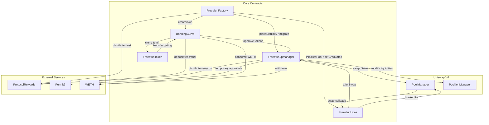
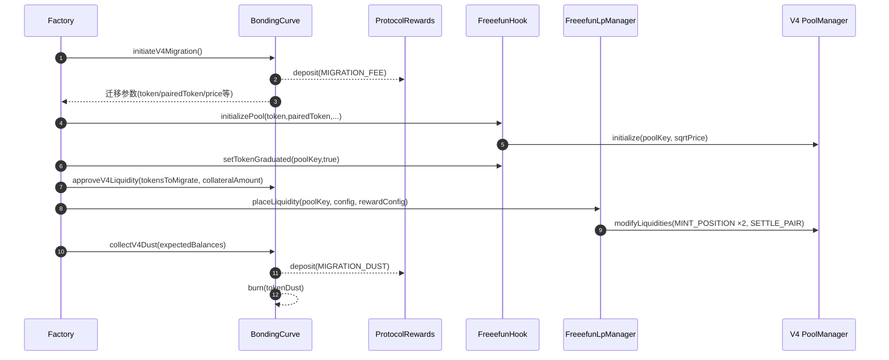
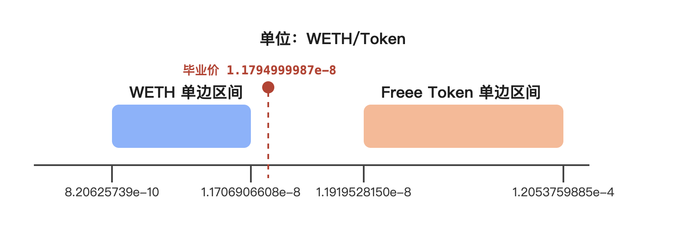
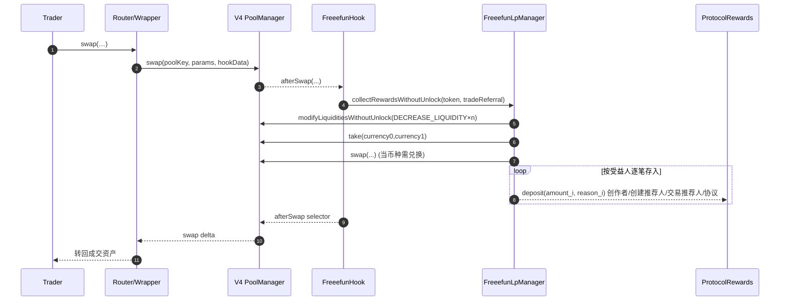

# Freeefun V4 系统总览

本文档汇总 Freeefun 协议在 Uniswap V4 上的整体设计，涵盖核心合约、关键流程、手续费循环、安全控制及现有测试覆盖。

## 0. Uniswap V4 概要

- **Hook 扩展**：V4 将 Hook 作为官方扩展点，所有 `swap/modifyLiquidity` 操作都会在核心逻辑前后回调 Hook（`before*`/`after*`）。FreeefunHook 正是利用 `afterSwap` 在交易完成后立刻归集手续费，避免像 v3 那样分两笔交易或依赖外部脚本。
- **统一资金库**：V4 的 `PoolManager` 托管所有池子的资产；Hook、LP Manager 只能通过 `take/settle`、`modifyLiquiditiesWithoutUnlock` 等统一接口与资金交互，安全边界更清晰。v3 则是每个池自持资产，扩展逻辑往往需要部署新的 pair 合约。
- **单事务组合**：配合 Permit2 / Universal Router，V4 可以在一次 Transaction 中完成授权、扣款、Hook 回调、手续费分润、ProtocolRewards 记账，减少中间步骤的失败点；V3 时代往往需要多笔交易串联。
- **Gas / 部署成本**：Hook 绑定在 `PoolKey` 上，Freeefun 可以在单一池中同时托管双向仓位与分润逻辑，减少部署多个独立池的 gas 与管理成本。

## 1. 体系结构

- **架构关系图**

- **FreeefunFactory**：唯一的入口，负责创建 Token、Bondingcurve阶段交易、触发毕业迁移、调用 Hook 与 LP Manager 完成建池与流动性添加。
- **BondingCurve**：BondingCurve 阶段的交易与筹资引擎，毕业后计算迁移参数、授权 V4 组件、收集迁移残余（dust）。
- **FreeefunHook**（`src/v4/FreeefunHook.sol`）：部署在 V4 池上的 Hook，负责创建池子、记录配置信息、在每次 swap 后触发手续费结算。
- **FreeefunLpManager**（`src/v4/FreeefunLpManager.sol`）：保存 LP 的数据信息，执行流动性的添加、 交易后 fee 收集与奖励分发。
- **FreeefunToken**（`src/FreeefunToken.sol`）：实际发行的 ERC20 代币，在 BondingCurve 阶段的转账限制，毕业后解除限制。
- **ProtocolRewards**: 奖励的记账合约。收集和记录奖励。
- **外部依赖**：Uniswap V4 `PoolManager`/`PositionManager`，Permit2，WETH。

## 2. 核心角色职责

- **Factory**  
  - 负责创建 BondingCurve/FreeefunToken，负责整个生命周期的“入口”；  
  - 在 BondingCurve 阶段代理所有对外买卖接口；  
  - 仅它能初始化 Hook 池、设定毕业状态，并调用 `FreeefunLpManager.placeLiquidity` 完成流动性的铸造；  
  - 统一触发 `initiateV4Migration` → `approveV4Liquidity` → `collectV4Dust` 等迁移步骤，串接 Hook/LP Manager/ProtocolRewards。
- **Hook**  
  - 记录池子 token 排序（`token0IsFreee`）、LP Manager 地址与毕业标志；  
  - 拒绝 `beforeInitialize` 自主初始化，确保只有 Factory 通过其接口建池；
  - 针对未毕业的池拒绝 `beforeAddLiquidity`，防止外部添加 LP；
  - 每次 swap 后解析推荐人、驱动 LP Manager 结算手续费，并广播详细 `Swapped` 事件。
- **LP Manager**  
  - 为每个 Token 维护 `TokenRewardInfo`，包含仓位数量、奖励分配和配对资产；  
  - 仅允许 Factory 添加流动性，且仅 Hook 能触发 `collectRewardsWithoutUnlock`；  
  - 通过 `_bringFeesIntoContract`、`_uniSwapUnlocked`、`_distributePairedTokenRewards` 完成手续费提取、兑换与分发。
- **BondingCurve**  
  - 持有全部初始 Token 供应，维护虚拟储备、首买费、市值阈值等参数，计算买卖价格并分发Bondingcurve阶段的交易手续费；  
  - 负责毕业判定（`tradingStopped`）
  - 计算迁移参数、WETH 转换以及 Dust 清算；  
- **FreeefunToken**  
  - 由 BondingCurve 克隆并一次性铸造，BondingCurve 阶段限制转账；  
  - 毕业后解除对交易对的限制，成为 V4 池中的交易资产。

## 3. Freeefun 代币生命周期

| 阶段 | 描述 | 关键调用/责任方 |
| --- | --- | --- |
| **1. 创建** | 通过 Factory 的创建方法完成 FreeefunToken 初始化，所有初始 Token 由 BondingCurve 持有。 | `FreeefunFactory.createFreeefunToken(_name, _symbol, _tokenURI, …)` `BondingCurve.initialize()` 创建 Token 并 `_mint` 到自身 |
| **2. BondingCurve 交易期** | 通过工厂的买卖入口，并按照 BondingCurve 的公式交易，费用按 TokenConstants 拆分给创作者/平台/推荐人/协议；同时维护虚拟储备、首买费与市值上限。 | Factory `buyExactIn/out` / `sellExactIn/out` → BondingCurve 计算并调用 `_distributeTradeRewards` |
| **3. 毕业判定** | 当市值超过 `mcLowerLimit`，BondingCurve 置 `tradingStopped = true`，Factory 标记 `readyForMigration[token] = true`，停止后续 BondingCurve 交易。 | BondingCurve `_performPostBuyChecks()`；Factory `readyForMigration` 映射 |
| **4. 迁移准备** | Factory 调用 `BondingCurve.initiateV4Migration()` 计算迁移参数并付迁移费用，返回 Hook、LP Manager、pairedToken、sqrtPriceX96 等信息。 | `BondingCurve.initiateV4Migration()` |
| **5. V4 建池 & 流动性添加** | Factory 通过 Hook 创建 V4 池并置毕业标记；BondingCurve 授权 LP Manager 后，Factory 调用 `placeLiquidity` 生成两段单边流动性；结束后调用 `collectV4Dust` 清理残余 Token/WETH。 | Hook `initializePool` / `setTokenGraduated` BondingCurve `approveV4Liquidity` LP Manager `placeLiquidity` BondingCurve `collectV4Dust` |
| **6. 迁移后交易** | Token 在 Uniswap V4 池中交易，每次 swap 后 Hook 自动驱动 LP Manager 结算手续费并按最新推荐人信息分润 | Hook `_afterSwap` → LP Manager `_collectRewards` → ProtocolRewards/受益人 |

### 生命周期概览
1. **发行**：Factory 创建 Token & BondingCurve → Token 供应归 BondingCurve 管理。  
2. **募资/交易阶段**：用户通过 Factory 进入 BondingCurve 交易，产生的交易费用奖励生态角色。  
3. **达到毕业阈值**：BondingCurve 停止常规交易，等待迁移。  
4. **调用迁移**：Factory 串行完成参数准备、V4 池部署、单边流动性注入、Dust 清理。  
5. **进入 V4 运营**：后续交易完全发生在 Uniswap V4 池内，Hook 实时结算手续费并按照新的流动性奖励规则分配。  

## 4. 迁移生命周期

下图概述了单次 V4 迁移的核心调用顺序：

1. **触发毕业**：BondingCurve 市值突破阈值，Factory 标记 `readyForMigration`。
2. **准备参数**（`BondingCurve.initiateV4Migration`）  
   - 计算迁移 Token 数量、抵押资产、sqrtPriceX96、默认 tickSpacing；  
   - 返回 LP Manager 与 Hook 地址供 Factory 后续使用；  
   - 支付固定迁移费，并（如有需要）将抵押资产转换为 WETH。
3. **建池 + 升级状态**  
   - Factory 调用 Hook 的 `initializePool` 创建带 Hook 的 V4 池；  
   - 紧接着调用 `setTokenGraduated(poolKey, true)` 解锁后续流动性操作。
4. **授权 & 铸造LP**  
   - BondingCurve 通过 `approveV4Liquidity` 授权 LP Manager；  
   - Factory 调用 `FreeefunLpManager.placeLiquidity`，批量创建两段单边流动性（Freee/Tide-in & pairedToken-only）。
5. **Dust 清理**  
   - Factory 调用 `collectV4Dust`，Burn 多余 Freee、将 WETH 赎回转入 ProtocolRewards（理由 MIGRATION_DUST）；  
   - 如为其它 ERC20 配对，则直接转账给协议奖励账户。

## 5. Hook 模块详述

- 构造时登记被信任的消息发送者，通过 `IMsgSender` 解决 meta-tx 场景下真实 swapper 的追踪。
- `afterSwap` 工作流：  
  1. 解析池 ID 找到 LP Manager；  
  2. 读取 Hook data 获取交易推荐人；  
  3. 调用 LP Manager 的 `collectRewardsWithoutUnlock`；  
  4. 记录真实 swapper、买入/卖出判定、池价（借助 `PoolStateReader.getSqrtPriceX96`）并发出 `Swapped` 事件。
- 仅声明 `beforeInitialize`/`beforeAddLiquidity`/`afterSwap` 权限，其余全部禁止，提高可审计性。

## 6. LP Manager 模块详述

- **状态结构**  
  - `TokenRewardInfo` 保存 positionId、position 数目、奖励配比、配对资产等；  
  - `_tokenRewards` 按 token 存储，防止重复迁移；  
  - `_inCollect` 阻止递归调用。
- **placeLiquidity 流程**  
  1. 验证输入参数与奖励配置；  
  2. 将 token/pairedToken 从 BondingCurve 拉入；  
  3. `_buildSingleSidedPositions` 计算两段单边仓位：  
     - 第一段提供配对资产（毕业价以下区间）、第二段提供 Freee；  
     - 通过 Tick 取整/对称转换，确保 Token 在 currency0/currency1 的不同排列下都能正确产生区间；  
     - 为长期流动性预留额外 10,000× 价格空间（`_getTickMultiplierFor10000x`）。  
  4. 使用 `modifyLiquidities` 批量 `MINT_POSITION` + `SETTLE_PAIR`；  
  5. 归还 dust 给 BondingCurve，并记录 `positionId` 与仓位数量。
- **安全措施**  
  - 仅 Hook 可调用 `collectRewardsWithoutUnlock`，阻断外部滥用；  
   - 使用 Permit2 临时授权 PositionManager，避免无限 allowance；  
  - `receive()` 限制只接受 WETH 合约退款。

### 流动性数据概览

下图展示 Base 主网中两段单边仓位所覆盖的 Freee Token 价格区间：

#### 核心价格参数

> 迁移后的 LP Manager 部署两段单边流动性：低价区间是 WETH 的单边流动性区间，为 Token 的卖盘提供对手方；高价区间是 Token 的单边流动性区间，为买盘提供接单空间。

> 采用两段而非覆盖当前价格的单一区间，是因为 Uniswap 若发现价格区间包含现价，会强制要求按现价比例同时存入两种资产，这个时候就无法添加全部的代币到流动池中；而将区间拆开即可单边注入 WETH 或 Freee，以实现将全部的资产添加到流动池中的目的。

- Bondingcurve阶段初始价格：`8.20625739e-10 WETH/Token` 
- 毕业时价格：`1.1794999987e-8 WETH/Token`。  
- WETH 单边仓位覆盖的 Freee 价格：`8.20625739e-10`(Bondingcurve初始价格) 至 `1.1706906608e-8 WETH/Token`（毕业价格）。  
- Freee 单边仓位覆盖的 Freee 价格：`1.1919528150e-8`（毕业价格） 至 `1.2053759885e-4 WETH/Token`（毕业价格大约10000倍）。  

#### Base 主网观测数据

| 场景 | 关键输入 | 观测数据 |
| --- | --- | --- |
| 单次大额卖出 | 抛售 Freee `398 602 752.365902529368449832` | 成交方实得 `1.896990840350847525` ETH |
| 价格下限测试 | 累计卖出 Freee `745 465 801.081191853411665082`，目标回收抵押金 `99%` | 实际换得 `2.327252134757131067` ETH；池中保留约 `0.023507597320779102` ETH 抵押；迁移者剩余 `54 298 592.887615896742435296` Freee |
| 价格上限测试 | 初始价格 `1.1794999987e-8 WETH/Token`，目标成交价 `1.20525546292191e-4 WETH/Token`（单边价格上界） | 需累计投入 `243.754751354102167959` WETH；触及上界时市值约 `120 424.98902414200260337` ETH（按照 ETH 的价格 3900 usd 计算大约是 469,657,457 usd） |

https://www.coingecko.com/en/categories/meme-token 
https://pump.fun/docs/fees

> 数据采集基于 Base 主网 Fork（脚本：`test/fork/v4/BaseMainnetLiquidityTest.t.sol`），所有数值采用 18 位精度换算。

## 7. 手续费收取流程

### 时序调用

- **流程描述**
  1. **交易执行**：用户通过路由器（或 aggregator）向 PoolManager 发起 swap，请求数据携带 Hook Data（可能含 tradeReferral）。  
  2. **Hook 回调**：PoolManager 在 `afterSwap` 回调中调用 Hook，Hook 解析池信息、推荐人后转调 LP Manager。  
  3. **手续费提取**：LP Manager 使用 `modifyLiquiditiesWithoutUnlock` 逐仓位执行零流动性的 `DECREASE_LIQUIDITY` + `TAKE_PAIR`，将 fee 拉入自身账户。  
  4. **必要兑换**：若提取的 fe e是 meme token，LP Manager 在“解锁上下文”下执行 `_uniSwapUnlocked` 将其转换成 WETH。  
  5. **多次记账**：对每个受益人（创作者/创建推荐人/交易推荐人/协议），LP Manager 分别调用 `ProtocolRewards.deposit`，金额与原因码（reason）按 BPS 配置计算。  
  6. **事件输出**：完成后 Hook/LP Manager 分别 emit `Swapped`、`ClaimedRewards`、`FeesSwapped`、`FeeDistributed` 等事件，供前端与分析使用。

## 8. 费用分润结构

| 发生阶段（时间顺序） | 费用/对象 | 占比（相对交易量） | 流向 | 说明 |
| --- | --- | --- | --- | --- |
| **首次买入**（BondingCurve 第一次 `buy`） | First Buy Fee | 固定值 `firstBuyFee` | ProtocolRewards（账本合约，reason=`FIRST_BUY_FEE`） | 仅首笔买入收取，资金交由 ProtocolRewards 托管并归属 `protocolRewardRecipient`。 |
| **BondingCurve 常规交易** | 交易手续费（汇总） | 占交易量 2% | ProtocolRewards（账本合约） | Factory 调用 BondingCurve 的交易方法后，统一将 2% 手续费记账。 |
|  | 创作者份额 | 占交易量 1%（50% × 2%） | ProtocolRewards（reason=`TRADE_FREEFUN_CREATOR_REWARD`） | 归属 payoutRecipient。 |
|  | 创建推荐人份额 | 占交易量 0.2%（10% × 2%） | ProtocolRewards（reason=`TRADE_FREEFUN_PLATFORM_REFERRER_REWARD`） | 未设置时回退至 `protocolRewardRecipient`。 |
|  | 交易推荐人份额 | 占交易量 0.2%（10% × 2%） | ProtocolRewards（reason=`TRADE_FREEFUN_TRADE_REFERRER_REWARD`） | 使用 tradeReferral，未设置时回退至协议。 |
|  | 协议份额 | 占交易量 0.6%（30% × 2%） | ProtocolRewards（reason=`TRADE_FREEFUN_PROTOCOL_REWARD`） | 归属 `protocolRewardRecipient`。 |
| **迁移准备** | Migration Fee | 固定 `fixedMigrationFee` | ProtocolRewards（reason=`MIGRATION_FEE`） | BondingCurve 在 `initiateV4Migration` 时一次性上缴。 |
| **V4 LP 奖励** | 交易手续费（汇总） | 占交易量 2% | ProtocolRewards（账本合约） | Hook 触发 LP Manager 收集 V4 手续费后统一记账。 |
|  | 创作者份额 | 占交易量 1%（50% × 2%） | ProtocolRewards（reason=`LIQUIDITY_CREATOR_REWARD`） | 归属 payoutRecipient。 |
|  | 创建推荐人份额 | 占交易量 0.2%（10% × 2%） | ProtocolRewards（reason=`LIQUIDITY_PLATFORM_REFERRER_REWARD`） | 未设置时回退协议。 |
|  | 交易推荐人份额 | 占交易量 0.2%（10% × 2%） | ProtocolRewards（reason=`LIQUIDITY_TRADE_REFERRER_REWARD`） | Hook 解析 tradeReferral，未设置时回退至协议。 |
|  | 协议份额 | 占交易量 0.6%（30% × 2%） | ProtocolRewards（reason=`LIQUIDITY_PROTOCOL_REWARD`） | 记入 `protocolRewardRecipient`。 |
| **迁移收尾** | Dust 回收 | 迁移余量 | ProtocolRewards（reason=`MIGRATION_DUST`） | BondingCurve `collectV4Dust` 将多余 WETH/ETH 上缴；Freee Token 余量直接 burn。 |

## 9. Dust 处理

- 迁移后 BondingCurve 可能由于精度原因残留少量 Freee 或配对资产；  
- `collectV4Dust` 通过“期望余额”计算超额：  
  - Freee 超额直接 `burn`；  
  - WETH 超额 `withdraw` → `ProtocolRewards.deposit(..., "MIGRATION_DUST")`；  
  - 其它 token 超额直接转账给 protocolRewardRecipient；  
  - 同时兜底合约残余 `address(this).balance`（通常来自 `withdraw` 的 rounding）。  
- 测试覆盖：`V4BondingCurveIntegrationTest.t.sol` 与 `V4MigrationTest.t.sol` 均验证 Dust 回收与零 Dust 情况；`FreeefunTokenForkBase.t.sol` 统计 ProtocolRewards 日志确保 MIGRATION_DUST 事件出现。

## 10. 关键安全控制

- Factory-only 模式，杜绝第三方初始化或添加流动性。  
- Hook `beforeAddLiquidity` 在毕业前直接 revert，防止迁移前被插入流动性。  
- LP Manager `collectRewards` 过程受 `_inCollect` 保护，并在 Hook 内执行，避免重入。  
- `_uniSwapUnlocked` 虽允许无限价差兑换，但因为仅在 Hook 后立即执行、且攻击者需自付对应手续费，目前仅构成 DoS 型威胁；若未来提高推荐人分润占比，需评估是否增加最小产出限制。  
- Dust 由工厂驱动并记录事件，可追踪迁移过程中可能的资产偏差。

## 11. 测试与排障指引

- **集成测试**：`test/fork/v4/base-sepolia/` 目录下的 `V4BondingCurveIntegrationTest`、`V4MigrationTest`、`V4LpManagerStandaloneTest` 覆盖了建池、铸造、手续费结算与 Dust 回收全流程。  
- **单元测试**：`test/unit/v4/TickCalculationOptimizationTest.t.sol` 验证 Tick 取整逻辑；确保 `_roundToTickSpacing` 在极端价格下无误。  
- **Fork/Base 监控**：`test/fork/base/FreeefunTokenForkBase.t.sol` 会统计迁移期间的 MIGRATION_DUST 事件，辅助评估价格效率。  
- **日志定位**：Hook `Swapped`、LP Manager `ClaimedRewards/FeesSwapped/FeeDistributed`、BondingCurve `DustCollected` 组合即可还原单次交易或迁移的完整路径。

## 12. 操作注意事项

1. 迁移流程需由 Factory 串行执行：`initiateV4Migration` → `initializePool` → `setTokenGraduated` → `approveV4Liquidity` → `placeLiquidity` → `collectV4Dust`。  
2. 任何合约升级或奖励比例调整后，应重新跑 `docs/V4_TESTING_TASK_LIST.md` 中列出的测试清单。  
3. 如果计划允许用户多次迁移或增量提供流动性，需扩展 Hook/LP Manager 以支持重新登记 `TokenRewardInfo` 与多份仓位。

如需进一步了解 Hook 配置、部署脚本或测试任务，可参阅：

- `docs/V4_HOOK_CONFIG_GUIDE.md`  
- `docs/V4_HOOK_DEPLOYMENT.md`  
- `docs/V4_Migration_Summary.md`  
- `docs/V4_TESTING_TASK_LIST.md`
