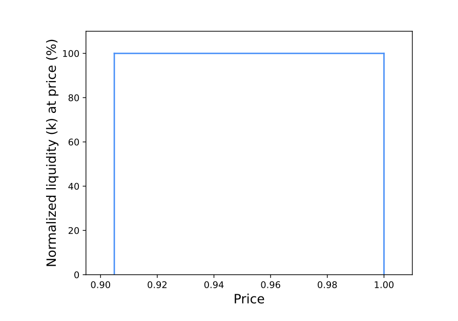
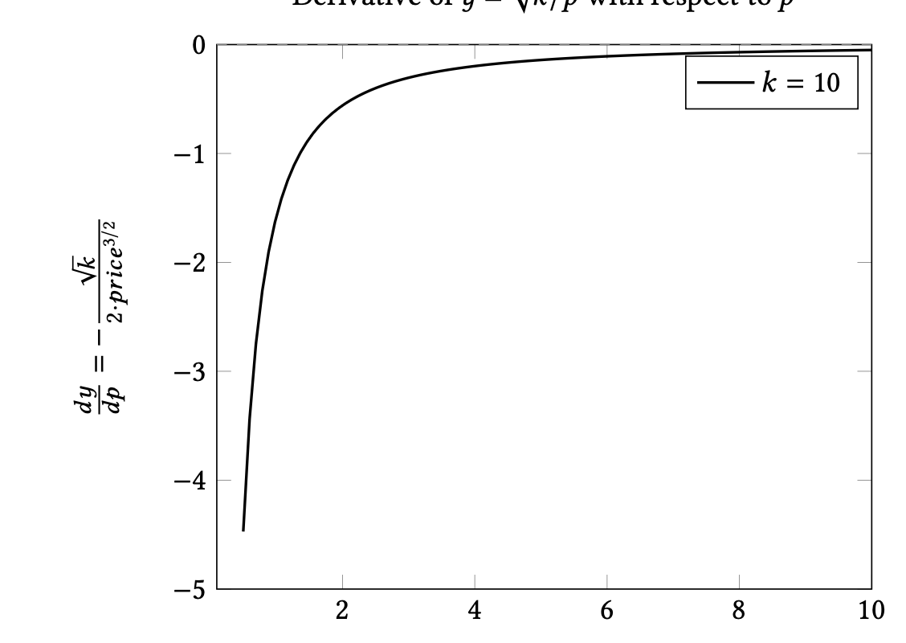
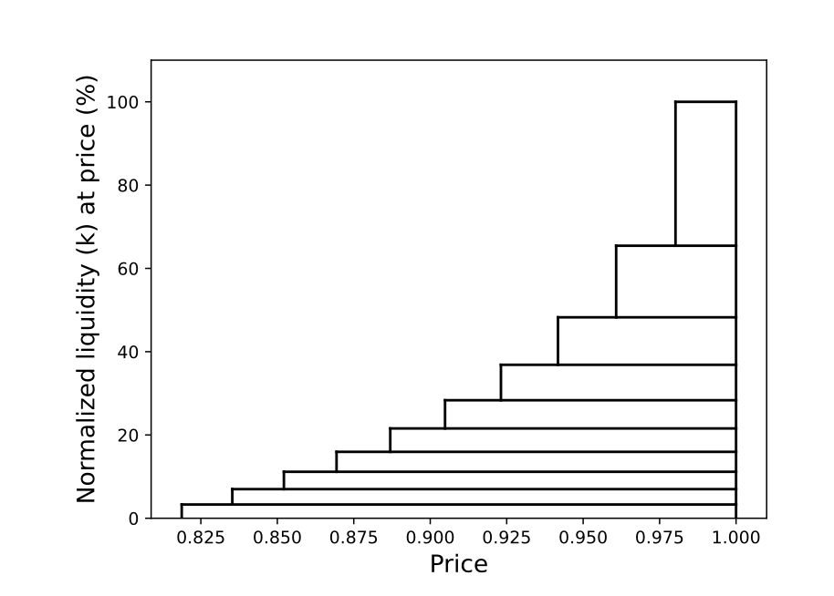

# Doppler Multicurve 白皮书总结

**文档版本**: April 2025  
**作者**: Austin Adams, Matt Czernik, Rohan Kulkarni, Cooper Kunz

## 1. 核心概念

### 1.1 什么是 Doppler Multicurve
Doppler Multicurve 是一个新的链上代币发行原语，允许在初始拍卖或流动性引导阶段指定**多条价格曲线**，可根据具体用例或应用需求进行定制。

### 1.2 解决的核心问题
传统集中流动性AMM（CLAMM）的静态绑定曲线存在根本性缺陷：
- **前载攻击严重**：大量代币集中在最便宜价格区间
- **MEV机器人获利**：早期买家（主要是MEV机器人）获得过多便宜代币
- **价格稀释效应**：机器人快速抛售，损害新买家和项目方利益
- **流动性效率低**：价格发现成本高，用户体验差



## 2. 技术原理

### 2.1 传统AMM的数学缺陷

在恒定乘积AMM中：
```
x · y = k (常数)
y = √(k/p)  (其中p为价格)
```

**问题根源**：
- 导数 `dy/dp = -√k/(2p^3/2) < 0`
- 价格越低，可购买代币数量越多
- 形成非线性递减，早期价格区间代币供应过多



### 2.2 Multicurve的解决方案

#### 核心机制：分层流动性配置
- **低价区间**：人为减少流动性密度
- **高价区间**：人为增加流动性密度
- **目标**：在每个价格桶中销售恒定数量的代币

#### 实现方法：
通过"shifting k value"（动态调整k值）对抗√(k/p)函数的非线性特性



## 3. 技术实现

### 3.1 单曲线设计

**参数配置**：
- `tickLower`: 流动性区间下边界
- `tickUpper`: 流动性区间上边界  
- `amount`: 代币总量
- `numPositions`: 流动性头寸数量

**算法逻辑**：
1. 代币总量平均分配给所有头寸
   ```
   positionTokens_i = amount / numPositions
   ```

2. 头寸线性分布
   ```
   tickLower_i = tickLower + ⌊i · (tickUpper - tickLower) / numPositions⌋
   ```

3. 形成阶梯状流动性结构

### 3.2 多曲线系统

**组合策略**：
- 允许多个曲线参数化组合
- 每个曲线针对不同价格区间和交易模式
- 由Doppler位置管理器统一管理

**设计示例**：
- **Curve1**: 早期价格发现（薄流动性，快速穿越）
- **Curve2**: 正常交易服务（厚流动性，降低滑点）

## 4. 核心优势

### 4.1 减少前载攻击

**机制**：
- **流动性稀缺化**：低价区间流动性不足
- **价格敏感性**：大额购买导致价格快速跳跃
- **时间窗口压缩**：MEV机器人无法长时间低价囤积
- **成本提升**：批量获取成本显著增加

**效果**：
- MEV机器人无法在低价区间"慢慢囤积"
- 抢跑的经济激励被大幅削弱
- 项目方和正常用户损失减少

### 4.2 降低价格发现成本

**机制**：
- **快速价格积累**：高价区间更多流动性使价格快速达到合理水平
- **减少价格冲击**：多曲线设计在高价区间降低滑点
- **避免价格稀释**：减少低价抛压，价格更容易找到真实价值

**数学基础**：
通过动态k值使每个价格区间的代币销售速率趋于均匀，而非传统AMM的exponential decay

### 4.3 提高资本效率

**流动性优化配置**：
- 在需要"防御"的地方使用"低流动性的武器"
- 在需要"服务"的地方使用"高流动性的便利"
- 实现"特性的策略性运用"

## 5. 实际案例验证

### 5.1 Zora实施效果

**量化结果**：
- 代币起始价格降低：从 $1,320 → $22（降低60倍）
- 前载攻击成本：保持相同水平
- 最终效果：更高流动性、更好价格发现

**意义**：
以相同的"安全成本"获得了显著更好的市场表现

### 5.2 与传统方案对比

| 指标 | 传统静态曲线 | Multicurve |
|------|-------------|------------|
| 早期代币分布 | 极度不均，MEV获利丰厚 | 相对均匀，MEV获利受限 |
| 价格发现效率 | 低，需要更多买盘推高价格 | 高，价格快速到达合理区间 |
| 用户体验 | 高滑点，被MEV夹击 | 低滑点，更公平交易 |
| 项目方收益 | 因MEV损失较大 | 价值保护更好 |

## 6. 技术考量

### 6.1 Gas效率优化

**设计原则**：
- **位置计算**：所有头寸可通过公式实时计算，减少链上存储
- **参数优化**：在连续性和gas成本间找到平衡点
- **批量管理**：通过Doppler位置管理器统一处理

### 6.2 兼容性

**现有生态集成**：
- 完全兼容Uniswap V3/V4
- 支持现有AMM集成
- 无需修改上层应用接口

### 6.3 Gap处理

**流动性间隙最小化**：
- 通过足够的`numPositions`确保连续性
- 在1%费用池中，最小gap约为200 tick (≈2%)
- 对高波动性代币可接受的滑点范围

## 7. 应用场景

### 7.1 适用项目类型

**高度适合**：
- 新代币发行项目
- 需要防MEV保护的代币
- 高波动性交易对
- 需要定制化价格路径的应用

**不适合**：
- 已有充足流动性的成熟代币
- 低波动性稳定币对
- 对gas成本极度敏感的应用

### 7.2 定制化策略

**多曲线组合示例**：
- **策略A**：早期发现 + 后期服务（双曲线）
- **策略B**：分阶段释放（多曲线递进）
- **策略C**：特定价格区间加强（局部密集化）

## 8. 理论意义

### 8.1 流动性概念革新

**传统认知**：流动性越多越好
**Multicurve洞察**：流动性需要"在对的地方用对的密度"

**流动性本质重新定义**：
- 表面：资产转换能力
- 深层：对未来交易需求的预期性配置
- 核心：对不确定性的智能风险管理

### 8.2 市场结构优化

**从被动到主动**：
- 传统AMM：被动提供一刀切流动性
- Multicurve：主动、策略性配置流动性
- 进化方向：让流动性成为智能防御机制

## 9. 未来展望

### 9.1 协议演进

**迭代优化**：
- 根据市场反馈持续优化曲线参数
- 探索更复杂的多曲线组合策略
- 降低初始流动性提供成本

### 9.2 生态影响

**行业影响**：
- 为DeFi提供更精细的流动性管理工具
- 推动从"一刀切"向"定制化"的paradigm shift
- 为更公平、高效的链上市场奠定基础

## 10. 总结

Doppler Multicurve 代表了DeFi基础设施的重要创新，通过数学和工程的结合，解决了传统AMM在代币发行阶段的根本性缺陷。其核心贡献在于：

1. **数学创新**：通过动态k值对抗constant product的固有缺陷
2. **工程智慧**：将流动性特性转化为策略工具
3. **实用价值**：显著减少MEV、提高效率、保护用户
4. **理论突破**：重新定义流动性的本质和配置原则

这不仅是一个技术解决方案，更是对链上市场微观结构的深刻思考和实践创新。

---

*本文档基于Doppler Multicurve白皮书(April 2025)整理，结合技术分析和实践案例。*